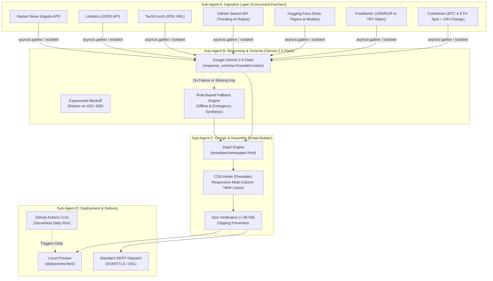

# 📰 The Morning Gazette Pipeline

[](https://www.python.org/)
[](https://ai.google.dev/)
[](https://github.com/)
[-success?style=flat&logo=pytest&logoColor=white)]()
[]()
[](LICENSE)

> **An autonomous editorial pipeline that aggregates tech, AI, finance, and startup intelligence from free/open APIs, synthesizes it with Google Gemini 2.5 Flash into structured JSON, and compiles a vintage newspaper email newsletter with inlined CSS under 85 KB.**

---

## 🌟 Executive Overview

**The Morning Gazette** re-imagines daily tech journalism through agentic engineering:
1. **Zero-Auth & Free Data Ingestion**: Concurrently aggregates real-time signals from Hacker News, Lobsters, TechCrunch RSS, GitHub Search API, Hugging Face Daily Papers, Frankfurter FX rates, and CoinGecko crypto markets.
2. **Structured LLM Intelligence**: Powered by **Google Gemini 2.5 Flash** with rigid Pydantic JSON schemas (`response_mime_type="application/json"`).
3. **Resilience & Fault Isolation**: Each source runs in an isolated `try-except` boundary with a 10s timeout. Includes a 3-step exponential backoff retry mechanism (for 429/500 errors) and an offline **Emergency Fallback Engine** that guarantees zero-downtime execution even without an API key or during outages.
4. **Classic Newspaper Aesthetics**: Rendered with Jinja2 into a responsive table-based email template (`newspaper.html`), inlined with `premailer`, and strictly compressed to **< 85 KB** to prevent Gmail clipping.
5. **Clean SMTP Delivery**: Standard SSL/TLS SMTP client (strictly avoids cumbersome Gmail OAuth2 scopes or external proprietary email SDKs).

---

## 🏛️ System Architecture



---

## 📂 Repository Structure

```text
morning-gazette/
├── deploy/
│   └── github-actions/
│       └── gazette.yml       # Scheduled GitHub Actions cron pipeline template
├── .env.example              # Documented environment template
├── .gitignore                # Zero-leakage git ignore rules
├── README.md                 # Project documentation & deployment guide
├── requirements.txt          # Pinned production & test dependencies
├── config.py                 # Pydantic Settings environment configuration
├── main.py                   # CLI entry point & orchestrator
├── fetchers/                 # Asynchronous data collectors
│   ├── __init__.py           # collect_all_data concurrent orchestrator
│   ├── base.py               # BaseFetcher abstract class & data models
│   ├── tech.py               # Hacker News, Lobsters, and TechCrunch
│   ├── github.py             # GitHub Search API & Hugging Face Papers
│   └── finance.py            # Frankfurter FX & CoinGecko Crypto
├── processors/               # AI reasoning & structured schema
│   ├── __init__.py
│   ├── schema.py             # Pydantic GazetteContent schema
│   └── summarizer.py         # Gemini 2.5 Flash & FallbackSummarizer
├── builders/                 # Layout & email delivery
│   ├── __init__.py
│   └── email_builder.py      # Jinja2 renderer, Premailer inliner, SMTP client
├── templates/
│   └── newspaper.html        # Vintage multi-column newspaper email template
└── tests/                    # Fully-isolated mock test suite
    ├── __init__.py
    ├── test_fetchers.py      # Network mocking & fault tolerance tests
    ├── test_summarizer.py    # Schema, retry backoff & fallback tests
    └── test_email_builder.py # Layout inlining, size bounds (<85KB) & SMTP tests
```

---

## 🚀 Quickstart Guide

### 1. Clone & Set Up Environment

```bash
# Clone the repository
git clone https://github.com/yunusemre-celik/morning-gazette-pipeline.git
cd morning-gazette-pipeline

# Create and activate virtual environment
python -m venv .venv
source .venv/bin/activate  # On Windows: .venv\Scripts\activate

# Install dependencies
pip install -r requirements.txt
```

### 2. Configure Environment

Copy `.env.example` to `.env`:

```bash
cp .env.example .env
```

```ini
# Google Gemini API Key (from Google AI Studio)
# If omitted or empty, the pipeline seamlessly operates in Graceful Fallback Mode!
GEMINI_API_KEY=your_gemini_api_key_here
GEMINI_MODEL=gemini-2.5-flash

# Standard SMTP Configuration (for sending emails)
SMTP_HOST=smtp.sendgrid.net
SMTP_PORT=587
SMTP_USER=apikey
SMTP_PASSWORD=your_smtp_key
SMTP_USE_TLS=true
SMTP_USE_SSL=false
SENDER_EMAIL=editor@morninggazette.internal
RECIPIENT_EMAILS=reader1@example.com,reader2@example.com

# Network & Operational Settings
REQUEST_TIMEOUT=10.0
MAX_RETRIES=3
LOG_LEVEL=INFO
```

### 3. Run Locally (Dry-Run / Local Preview)

Generate a standalone local preview without dispatching emails:

```bash
python main.py --dry-run
```

*Sample CLI output:*
```text
[Step 1/4] Ingesting data from tech, AI, and finance sources...
  - Hacker News, Lobsters, TechCrunch, GitHub, Hugging Face, Frankfurter, CoinGecko: 200 OK
  - Ingested: 45 tech stories, 10 repos, 15 papers, 2 FX rates, 2 crypto prices.
[Step 2/4] Synthesizing editorial content with Gemini (or Fallback)...
  - Front Page Lead, Venture & Tech Stories, AI Spotlight, and Market Briefing synthesized.
[Step 3/4] Rendering newspaper layout and inlining CSS...
  - Rendered inlined HTML size: 40.00 KB (< 85 KB threshold).
[Step 4/4] Finalizing delivery...
  - Preview saved to: dist/preview.html
  - [DRY-RUN ACTIVE] Email dispatch skipped. View preview at: dist/preview.html
```

Open `dist/preview.html` directly in your browser to inspect the publication!

### 4. Dispatch Email via SMTP

```bash
python main.py --force-send
```

---

## 🧪 Testing & Verification

The suite includes **24 automated tests** with 100% mock coverage. No live external network calls or valid API keys are required during testing:

```bash
pytest -v
```

```text
tests/test_email_builder.py::test_template_rendering_and_inlining PASSED
tests/test_email_builder.py::test_html_size_under_85kb PASSED
tests/test_email_builder.py::test_preview_saving PASSED
tests/test_email_builder.py::test_send_email_aborts_without_smtp_credentials PASSED
tests/test_email_builder.py::test_send_email_tls_success_mock PASSED
tests/test_email_builder.py::test_send_email_ssl_success_mock PASSED
tests/test_fetchers.py::test_hacker_news_fetcher_success PASSED
tests/test_fetchers.py::test_hacker_news_fetcher_error_isolation PASSED
tests/test_fetchers.py::test_lobsters_fetcher_success PASSED
tests/test_fetchers.py::test_techcrunch_rss_fetcher_success PASSED
tests/test_fetchers.py::test_github_fetcher_rate_limit_graceful PASSED
tests/test_fetchers.py::test_github_fetcher_success PASSED
tests/test_fetchers.py::test_huggingface_fetcher_success PASSED
tests/test_fetchers.py::test_frankfurter_fetcher_success PASSED
tests/test_fetchers.py::test_coingecko_fetcher_rate_limit_graceful PASSED
tests/test_fetchers.py::test_coingecko_fetcher_success PASSED
tests/test_fetchers.py::test_collect_all_data_integration PASSED
tests/test_summarizer.py::test_pydantic_schema_valid_construction PASSED
tests/test_summarizer.py::test_pydantic_schema_missing_fields_raises_validation_error PASSED
tests/test_summarizer.py::test_fallback_summarizer_with_rich_data PASSED
tests/test_summarizer.py::test_fallback_summarizer_with_empty_data PASSED
tests/test_summarizer.py::test_gemini_summarizer_without_api_key_activates_fallback PASSED
tests/test_summarizer.py::test_gemini_summarizer_success_mock PASSED
tests/test_summarizer.py::test_gemini_summarizer_retry_and_fallback_on_consecutive_errors PASSED

============================= 24 passed in 3.42s ==============================
```

---

## ☁️ Deployment & Hosting Strategies

Because this pipeline runs on a scheduled cadence (e.g., once every morning) rather than listening for incoming web traffic 24/7, **serverless cron runners** are the most cost-effective and resilient architectures.

### Option 1: GitHub Actions (Recommended — 100% Free & Zero-Ops)
This repository includes a ready-to-use workflow template in [`deploy/github-actions/gazette.yml`](deploy/github-actions/gazette.yml):
* **Cost**: $0 / month (uses standard free GitHub Actions minutes).
* **Schedule**: Automated cron every weekday at 06:00 UTC (`0 6 * * 1-5`).
* **Artifacts**: Automatically uploads `dist/preview.html` as a downloadable run artifact.
* **How to activate**:
  1. Copy `deploy/github-actions/gazette.yml` to `.github/workflows/gazette.yml` in your repository.
  2. In your GitHub repository, navigate to **Settings > Secrets and variables > Actions**.
  3. Add Repository Secrets: `GEMINI_API_KEY`, `SMTP_HOST`, `SMTP_USER`, `SMTP_PASSWORD`, `SENDER_EMAIL`, `RECIPIENT_EMAILS`.
  4. Trigger the workflow manually from the **Actions** tab or let the cron run autonomously!

### Option 2: Serverless Cron on Modal / Modal Labs
For low-latency Python scheduling with serverless execution:
```python
import modal
app = modal.App("morning-gazette")
image = modal.Image.debian_slim().pip_install_from_requirements("requirements.txt")

@app.function(schedule=modal.Cron("0 6 * * 1-5"), image=image, secrets=[modal.Secret.from_name("gazette-secrets")])
def run_daily_gazette():
    import subprocess
    subprocess.run(["python", "main.py", "--force-send"], check=True)
```

### Option 3: Google Cloud Run Jobs / AWS Lambda
* Package the application into a Docker container.
* Trigger daily via **Google Cloud Scheduler** (Cloud Run Job) or **Amazon EventBridge** (AWS Lambda / ECS task).
* Billed purely for the ~10 seconds of compute used each morning (fraction of a cent).

### Option 4: Linux VPS / Raspberry Pi / Always-On Server
Set up a standard Linux crontab:
```bash
# Crontab entry: Every morning at 06:00
0 6 * * 1-5 cd /home/user/morning-gazette && /home/user/morning-gazette/.venv/bin/python main.py --force-send >> /var/log/gazette.log 2>&1
```

---

## 🔒 Security & Standards Compliance

* **Zero-Leakage Policy**: No API keys, credentials, or email addresses are hardcoded in the codebase.
* **Gmail-Friendly**: All styles inlined; strictly enforces HTML size under 85 KB to prevent email clipping.
* **No Bloat**: Strictly excluded OAuth2 libraries, Gmail API scopes, and third-party weather widgets.

---

## 📄 License

Distributed under the MIT License. See `LICENSE` for details.
