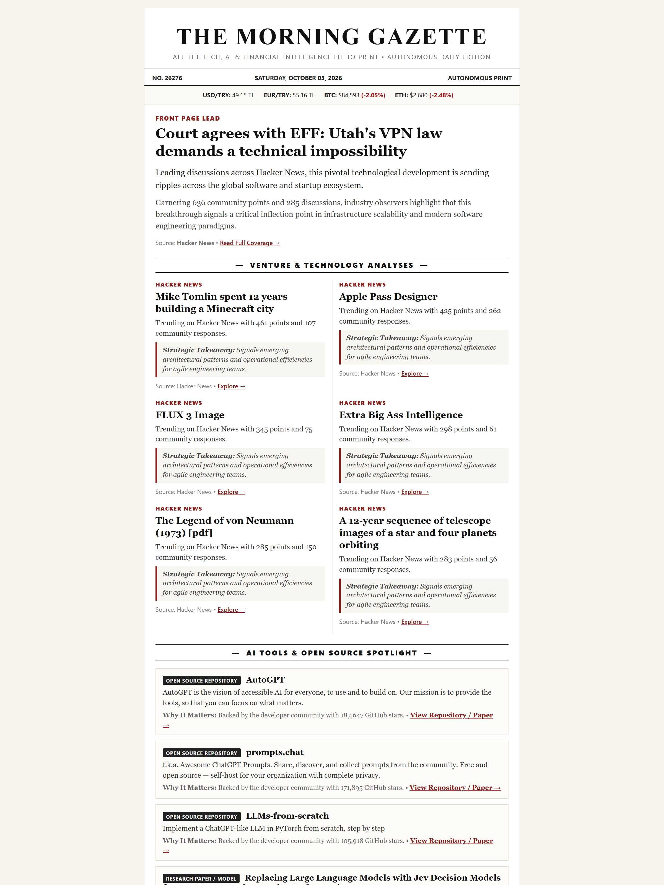
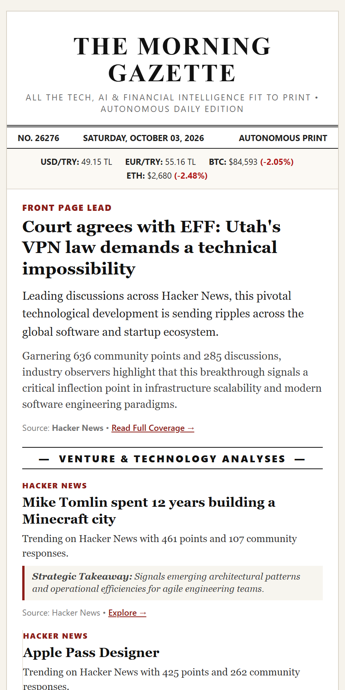
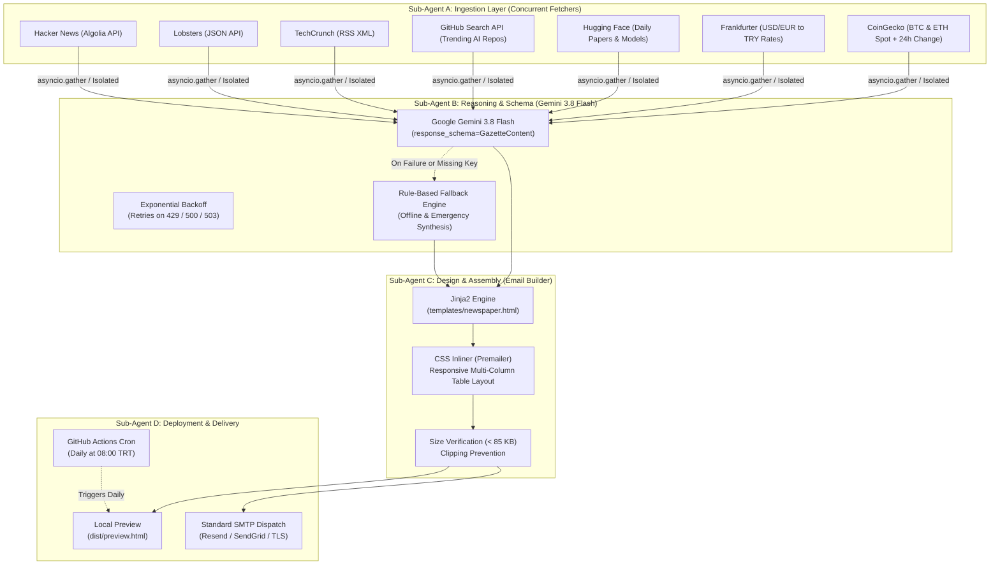

# 📰 The Morning Gazette Pipeline

[](https://www.python.org/)
[](https://ai.google.dev/)
[](https://github.com/)
[-success?style=flat&logo=pytest&logoColor=white)]()
[]()
[](LICENSE)

> **An autonomous editorial pipeline that aggregates tech, AI, finance, and startup intelligence from free/open APIs, synthesizes it with Google Gemini 3.8 Flash into structured JSON, and compiles a vintage broadsheet newspaper email newsletter with inlined CSS strictly under 85 KB.**

---

## 📸 Visual Showcase & Demo

<p align="center">
  
</p>

### 🗞️ Responsive Broadsheet Layout (Desktop vs. Mobile)

<table align="center" width="100%">
  <tr>
    <td align="center" width="65%" valign="top">
      <b>📰 Desktop Broadside (Vintage Multi-Column)</b><br/><br/>
      
    </td>
    <td align="center" width="35%" valign="top">
      <b>📱 Mobile View (Inlined & Responsive)</b><br/><br/>
      
    </td>
  </tr>
</table>

*The entire email is inlined with table-safe HTML and compressed to **~40 KB**, guaranteeing zero Gmail clipping (102 KB limit).*

---

## 🌟 Executive Overview

**The Morning Gazette** re-imagines daily tech journalism through agentic engineering:
1. **Zero-Auth & Free Data Ingestion**: Concurrently aggregates real-time signals from Hacker News, Lobsters, TechCrunch RSS, GitHub Search API, Hugging Face Daily Papers, Frankfurter FX rates, and CoinGecko crypto markets.
2. **Structured LLM Intelligence**: Powered by **Google Gemini 3.8 Flash** with rigid Pydantic JSON schemas (`response_mime_type="application/json"`).
3. **Resilience & Fault Isolation**: Each source runs in an isolated `try-except` boundary with a 10s timeout. Includes a 3-step exponential backoff retry mechanism (for 429/500/503 errors) and an offline **Emergency Fallback Engine** that guarantees zero-downtime execution even without an API key or during outages.
4. **Classic Newspaper Aesthetics**: Rendered with Jinja2 into a responsive table-based email template (`newspaper.html`), inlined with `premailer`, and strictly compressed to **< 85 KB** to prevent Gmail clipping.
5. **Clean SMTP Delivery**: Standard SSL/TLS SMTP client supporting modern providers like **Resend**, SendGrid, and Mailgun with zero external proprietary SDK bloat.

---

## 🏛️ System Architecture



---

## 📂 Repository Structure

```text
morning-gazette/
├── .github/
│   └── workflows/
│       └── gazette.yml       # Scheduled GitHub Actions cron pipeline (08:00 TRT)
├── assets/                   # Visual demo GIF, screenshots & documentation media
│   ├── newsletter_demo.gif
│   ├── newsletter_demo.mp4
│   ├── newsletter_preview.png
│   └── newsletter_mobile_preview.png
├── .env.example              # Documented environment template
├── .gitignore                # Zero-leakage git ignore rules
├── README.md                 # Complete documentation & customization guide
├── requirements.txt          # Production & test dependencies
├── config.py                 # Pydantic Settings environment configuration
├── main.py                   # CLI entry point & orchestrator
├── fetchers/                 # Asynchronous data collectors
│   ├── __init__.py           # collect_all_data concurrent orchestrator
│   ├── base.py               # BaseFetcher abstract class & data models
│   ├── tech.py               # Hacker News, Lobsters, and TechCrunch RSS
│   ├── github.py             # GitHub Search API & Hugging Face Papers
│   └── finance.py            # Frankfurter FX & CoinGecko Crypto
├── processors/               # AI reasoning & structured schema
│   ├── __init__.py
│   ├── schema.py             # Pydantic GazetteContent schema
│   └── summarizer.py         # Gemini 3.8 Flash & FallbackSummarizer
├── builders/                 # Layout & email delivery
│   ├── __init__.py
│   └── email_builder.py      # Jinja2 renderer, Premailer inliner, SMTP client
├── templates/
│   └── newspaper.html        # Vintage broadsheet multi-column email template
└── tests/                    # Fully-isolated mock test suite (24/24 passing)
    ├── __init__.py
    ├── test_fetchers.py      # Network mocking & fault tolerance tests
    ├── test_summarizer.py    # Schema, retry backoff & fallback tests
    └── test_email_builder.py # Layout inlining, size bounds (<85KB) & SMTP tests
```

---

## 🚀 Quickstart Guide

### 1. Clone & Set Up Environment

```bash
# Clone the repository
git clone https://github.com/yunusemre-celik/morning-gazette-pipeline.git
cd morning-gazette-pipeline

# Create and activate virtual environment
python -m venv .venv
source .venv/bin/activate  # On Windows: .venv\Scripts\activate

# Install dependencies
pip install -r requirements.txt
```

### 2. Configure Environment (`.env`)

Copy `.env.example` to `.env`:

```bash
cp .env.example .env
```

```ini
# Google Gemini API Key (from Google AI Studio)
# If omitted or empty, the pipeline operates in Graceful Fallback Mode!
GEMINI_API_KEY=your_gemini_api_key_here
GEMINI_MODEL=gemini-3.8-flash

# SMTP Configuration (Example: Resend SMTP)
SMTP_HOST=smtp.resend.com
SMTP_PORT=587
SMTP_USER=resend
SMTP_PASSWORD=re_your_resend_api_key_here
SMTP_USE_TLS=true
SMTP_USE_SSL=false
SENDER_EMAIL=gazette@yourdomain.dev
RECIPIENT_EMAILS=subscriber1@example.com,subscriber2@example.com

# Network & Operational Settings
REQUEST_TIMEOUT=10.0
MAX_RETRIES=3
LOG_LEVEL=INFO
```

### 3. Generate Local Preview (Dry-Run)

Generate a standalone local preview without dispatching emails:

```bash
python main.py --dry-run
```

Open `dist/preview.html` directly in any web browser to inspect the publication!

### 4. Dispatch Email via SMTP

```bash
python main.py --force-send
```

---

## ⏰ Autonomous Scheduling (GitHub Actions)

The pipeline is pre-configured with a daily cron job running at **08:00 AM Turkish Time (05:00 UTC)**:
File: [`.github/workflows/gazette.yml`](.github/workflows/gazette.yml)

### Setting up Repository Secrets

Go to your GitHub repository: **Settings > Secrets and variables > Actions > New repository secret**, and define:

| Secret Name | Description / Example |
| :--- | :--- |
| `GEMINI_API_KEY` | Google AI Studio API Key |
| `SMTP_HOST` | `smtp.resend.com` (or SendGrid/Mailgun) |
| `SMTP_PORT` | `587` |
| `SMTP_USER` | `resend` |
| `SMTP_PASSWORD` | Resend API Key (`re_...`) |
| `SMTP_USE_TLS` | `true` |
| `SMTP_USE_SSL` | `false` |
| `SENDER_EMAIL` | Verified sender address (e.g. `gazette@yourdomain.dev`) |
| `RECIPIENT_EMAILS` | Comma-separated subscriber emails (`a@b.com, c@d.com`) |

*Once added, the cron will autonomously deliver the morning gazette every day, and can also be triggered manually anytime via the **Actions** tab.*

---

## 🛠️ Complete Customization Guide

The pipeline is designed to be fully modular. You can easily tailor data feeds, AI tone, sections, and aesthetics to your preferences:

### 1. Adding or Modifying News & RSS Feeds
File: [`fetchers/tech.py`](fetchers/tech.py)

To add your favorite tech blogs, newsletters, or regional news outlets (e.g. The Verge, Webrazzi, Wired), create an RSS fetcher or append URLs:
```python
class CustomRSSFetcher(BaseFetcher):
    RSS_URL = "https://example.com/feed.xml"
    # Parsed automatically into TechStory objects
```

### 2. Customizing GitHub Topics & AI Repositories
File: [`fetchers/github.py`](fetchers/github.py#L39)

Change the search topic query to track any engineering ecosystem:
```python
params = {
    # Examples: "topic:cybersecurity", "topic:rust language:rust", "topic:agentic-ai"
    "q": "topic:artificial-intelligence stars:>100",
    "sort": "stars",
    "order": "desc",
    "per_page": 10,
}
```

### 3. Modifying Crypto Assets & Foreign Exchange
File: [`fetchers/finance.py`](fetchers/finance.py)

- **Crypto Tokens**: Update CoinGecko IDs from `bitcoin,ethereum` to `solana,avalanche,ripple`.
- **Currencies**: Add any global currency supported by Frankfurter API (e.g., `GBP`, `JPY`, `CHF`).

### 4. Changing Language, AI Persona & Editorial Tone
File: [`processors/summarizer.py`](processors/summarizer.py#L202)

In `_prepare_prompt()`:
- **Switch Language**: Change the prompt instruction from *"Produce a newspaper digest in English"* to *"Produce a structured, executive-level newspaper digest in Turkish (Türkçe)"*.
- **Persona**: Guide Gemini to adopt different perspectives (e.g. *Senior Cybersecurity Architect*, *Venture Capital Analyst*, or *Indie Hacker*).

### 5. Customizing Newspaper Sections & Layout
- **Data Model**: Edit [`processors/schema.py`](processors/schema.py) to add new fields (e.g. `book_of_the_day`, `github_trending_dev`, `quote_of_the_morning`).
- **Template & Styling**: Edit [`templates/newspaper.html`](templates/newspaper.html) to adjust fonts, masthead title, column proportions, or color schemes (e.g., modern dark mode or minimalist typography).

---

## 🧪 Testing & Verification

The suite includes **24 automated tests** with 100% mock coverage. No network calls or active API keys are needed:

```bash
pytest -v
```

```text
============================= 24 passed in 3.50s ==============================
```

---

## 🔒 Security & Standards Compliance

* **Zero-Leakage Policy**: No API keys, credentials, or private addresses are committed or logged.
* **Strict Gmail Inlining**: Premailer compiles all styles into table attributes and keeps the total email payload below **85 KB** to prevent clipping.
* **Resilient Degradation**: If external APIs or Gemini hit transient outages or rate limits, the rule-based Fallback engine guarantees zero pipeline crashes.

---

## 📄 License

Distributed under the MIT License. See [LICENSE](LICENSE) for details.
